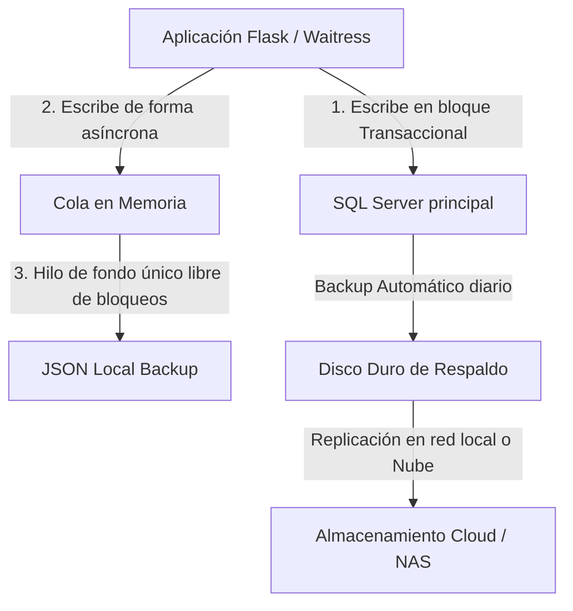

# Propuesta de Seguridad, Redundancia y Prevención de Corrupción de Datos

Este documento presenta una serie de sugerencias de diseño y de infraestructura para garantizar la máxima seguridad y durabilidad de los datos históricos y operativos en **QB-SAO**.

---

## 1. Arquitectura de Respaldo Híbrido (Propuesta General)



---

## 2. Sugerencias a Nivel de Aplicación (Código Python)

### A. Mecanismo de Escritura JSON Asíncrono y en Hilo Único (Queue-based Writer)
* **El Problema:** El error `WinError 5: Acceso denegado` ocurre cuando múltiples subprocesos (hilos de Waitress) intentan escribir en `factura_metadata.json` al mismo tiempo.
* **La Solución:** Crear un hilo de ejecución independiente (`daemon thread`) con una cola de tareas (`queue.Queue`).
  * Cuando la aplicación realiza un cambio, en lugar de escribir al disco directamente, envía los datos a la cola de la memoria.
  * El hilo único procesa la cola de forma secuencial, garantizando que **solo un proceso a la vez** tenga acceso de escritura al archivo, eliminando el error por completo.

### B. Transacciones Atómicas (SQLAlchemy `begin()`)
* Asegurar que todas las operaciones complejas (por ejemplo, guardar una relación de envíos y al mismo tiempo marcar sus facturas correspondientes) utilicen transacciones atómicas.
* Si el guardado de una factura falla, toda la transacción de la relación se cancela automáticamente (`rollback`), previniendo estados inconsistentes o registros huérfanos.

---

## 3. Sugerencias a Nivel de Base de Datos (SQL Server)

### A. Estrategia de Backups Automáticos con SQL Server Agent
Configurar tareas programadas (`Jobs`) para respaldar la base de datos de manera incremental:
1. **Respaldos Completos (Full Backup):** Cada noche a las 00:00 hrs.
2. **Respaldos Diferenciales (Differential Backup):** Cada 4 horas durante la jornada laboral.
3. **Respaldos de Registro de Transacciones (Transaction Log Backup):** Cada 15 o 30 minutos.
   * *Beneficio:* Permite la **Recuperación en el Punto en el Tiempo (PITR)**. Si la base de datos se corrompe a las 11:34, es posible restaurar el estado exacto de los datos a las 11:30, perdiendo máximo 4 minutos de trabajo.

### B. Mantenimiento Automático de Índices e Integridad
Configurar un plan de mantenimiento semanal en SQL Server que ejecute:
* `DBCC CHECKDB`: Verifica la integridad física y lógica de los archivos de base de datos para detectar cualquier corrupción incipiente a nivel de disco.
* Reorganización y reconstrucción de índices para mantener la rapidez en las consultas de relaciones históricas.

---

## 4. Sugerencias a Nivel de Infraestructura y Redundancia

### A. Replicación a un Directorio de Red Seguro (NAS) o Servicio en la Nube
* **Script de Sincronización Programado:** Configurar una tarea de Windows (Task Scheduler) que ejecute un script ligero para copiar tanto la base de datos como los archivos JSON locales en una carpeta de red externa (NAS) o en una cuenta de almacenamiento en la nube (OneDrive empresarial, Azure Blob o AWS S3).
* *Beneficio:* Protege contra fallas físicas de la máquina actual (daños en disco duro, apagones destructivos).

### B. Notificación Automática de Errores de Conexión o Escritura
* Integrar un sistema de alertas por correo electrónico o Webhooks (Slack/Teams/Discord).
* Si el cliente de base de datos falla al conectarse por más de 3 intentos consecutivos, el sistema envía un mensaje de alerta inmediato al equipo de sistemas antes de que los usuarios noten el fallo.

---

## 5. Borrador de Automatización: Script de Respaldos (PowerShell)

Para facilitar la implementación rápida de respaldos, sugerimos el siguiente script de PowerShell que se puede programar en el **Programador de Tareas de Windows (Task Scheduler)** para ejecutarse diariamente de forma automática:

```powershell
# ============================================================
#  Script de Respaldo Automatizado QB-SAO
# ============================================================

$BackupDir = "C:\Users\QB_DESARROLLO\Desktop\Backups_Historicos"
$ProjectDir = "C:\Users\QB_DESARROLLO\Desktop\QB-SAO PROD"
$Timestamp = Get-Date -Format "yyyyMMdd_HHmmss"
$BackupFolder = Join-Path $BackupDir $Timestamp

# 1. Crear directorios de destino
New-Item -ItemType Directory -Force -Path $BackupFolder | Out-Null

# 2. Respaldar archivos JSON Locales (invoices, estados, metadatos)
$LocalDataPath = Join-Path $ProjectDir "data"
if (Test-Path $LocalDataPath) {
    Compress-Archive -Path $LocalDataPath -DestinationPath (Join-Path $BackupFolder "sao_local_data.zip") -Force
}

# 3. Respaldar Base de Datos SQL Server (SGA_Database)
$Server = "192.168.2.237"
$Database = "SGA_Database"
$BackupFile = Join-Path $BackupFolder "SGA_Database.bak"

# Consulta SQL para ejecutar el BACKUP de la DB
$SqlQuery = "BACKUP DATABASE [$Database] TO DISK = N'$BackupFile' WITH NOFORMAT, NOINIT, NAME = N'$Database-Full Database Backup', SKIP, NOREWIND, NOUNLOAD, STATS = 10"

# Ejecutar el backup (requiere que el usuario ejecutor tenga permisos en SQL Server)
Invoke-Sqlcmd -ServerInstance $Server -Query $SqlQuery -ErrorAction Stop

# 4. Limpieza de respaldos antiguos (mantener últimos 7 días)
Get-ChildItem -Path $BackupDir | Where-Object { $_.PSIsContainer -and ($_.CreationTime -lt (Get-Date).AddDays(-7)) } | Remove-Item -Recurse -Force
```

