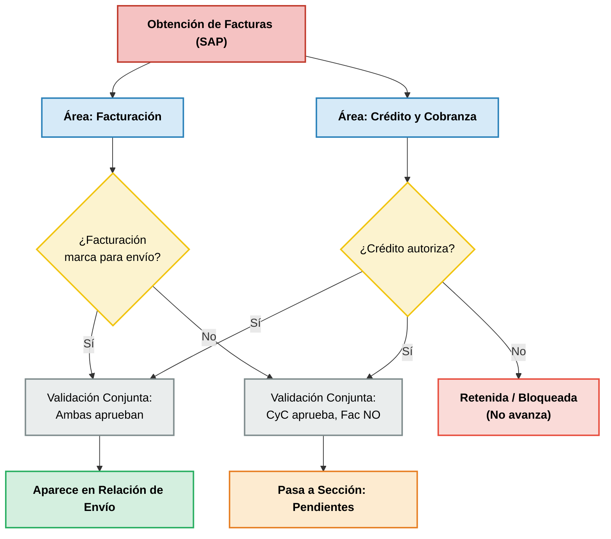

# Flujo de Trabajo: Validación y Envío de Facturas (SAP)

Este documento describe el flujo lógico que experimenta una factura obtenida de SAP dentro del sistema Open-OMS. El proceso se ejecuta en paralelo entre el área de **Facturación** y el área de **Crédito y Cobranza (CyC)**.

---

## 1. Diagrama de Flujo (Mermaid)

---

## 2. Descripción de los Componentes y Estados

| Elemento / Estado | Descripción | Regla de Negocio / Comportamiento |
| :--- | :--- | :--- |
| **Obtención de Facturas (SAP)** | Extracción de los datos de facturación desde SAP Business One. | Punto de partida del flujo de trabajo local. |
| **Áreas Operativas** | Trabajo en paralelo e independiente para **Facturación** y **Crédito y Cobranza**. | Ambas áreas ven la misma lista de facturas de forma independiente para evitar bloqueos secuenciales. |
| **¿Facturación marca para envío?** | Decisión del departamento de Facturación. | Determina si la factura está lista/seleccionada físicamente para su distribución. |
| **¿Crédito autoriza?** | Decisión del departamento de Crédito y Cobranza. | Evalúa el estado crediticio de la cuenta antes de liberar la factura. |
| **Validación Conjunta: Ambas aprueban** | Intersección donde tanto Facturación como CyC han dado luz verde. | Requisito indispensable para el despacho de mercancía. |
| **Validación Conjunta: CyC aprueba, Fac NO** | Intersección donde CyC ha autorizado el crédito, pero Facturación no la ha marcado. | Envía la factura a un estado de espera de despacho. |
| **Aparece en Relación de Envío** | Estado final de la factura lista para ser embarcada. | Requiere: `Facturación = SÍ` Y `CyC = SÍ`. |
| **Pasa a Sección: Pendientes** | Estado de la factura en espera de ser marcada por Facturación. | Requiere: `Facturación = NO` Y `CyC = SÍ`. |
| **Retenida / Bloqueada** | Estado restrictivo que detiene por completo la factura. | Ocurre cuando `CyC = NO`. No avanza sin importar la decisión de Facturación. |

---

## 3. Reglas Especiales y Salvaguardas

### 🛡️ Salvaguarda de Revocación de Autorización
Si una factura fue aprobada previamente por **Crédito y Cobranza** y se encuentra en **Relación de Envío** o en **Pendientes**, pero el departamento de Crédito revoca su autorización (p. ej., por rebasar límite de crédito o error humano):
- La factura se **elimina automáticamente** de la Relación de Envío o de Pendientes.
- La factura regresa al estado **Retenida / Bloqueada (No avanza)**.

---

## 4. Archivos de Referencia en el Código

El comportamiento de este flujo y sus interfaces correspondientes se encuentran implementados en los siguientes componentes:

*   **Lógica Documentada**: [logica_de_envios.md](file:///c:/Users/CarlosAlbertoAcevesC/Desktop/DEV%20SAO/logica_de_envios.md)
*   **Interfaz de Facturación**: [_facturas_tab.html](file:///c:/Users/CarlosAlbertoAcevesC/Desktop/DEV%20SAO/templates/orders/partials/_facturas_tab.html)
*   **Interfaz de Crédito y Cobranza**: [_credito_tab.html](file:///c:/Users/CarlosAlbertoAcevesC/Desktop/DEV%20SAO/templates/orders/partials/_credito_tab.html)
*   **Sección de Pendientes**: [_pendientes_tab.html](file:///c:/Users/CarlosAlbertoAcevesC/Desktop/DEV%20SAO/templates/orders/partials/_pendientes_tab.html)
*   **Sección de Relaciones**: [_relaciones_tab.html](file:///c:/Users/CarlosAlbertoAcevesC/Desktop/DEV%20SAO/templates/orders/partials/_relaciones_tab.html)
