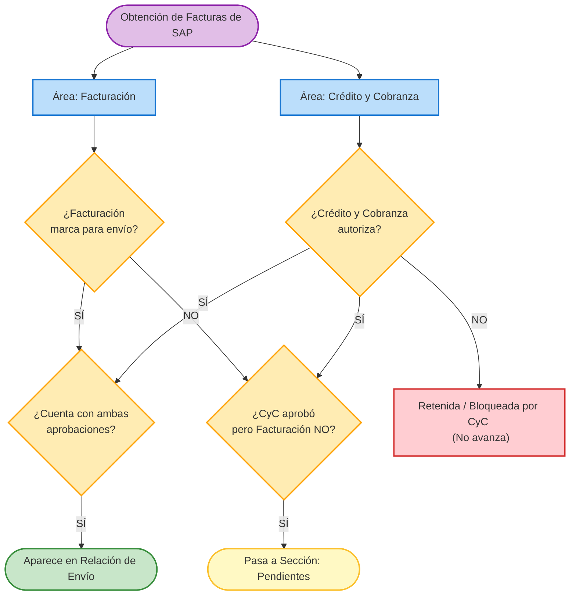

# Lógica de Envíos y Facturas

Este documento define la lógica central para el flujo de trabajo de facturas, su selección para envío y la transición a la sección de pendientes.

## 1. Flujo de Trabajo (Workflow)

El proceso sigue las siguientes reglas establecidas para asegurar un correcto manejo de los envíos:

1. **Obtención desde SAP**: Todas las facturas se obtienen inicialmente a través del sistema SAP.
2. **Visualización Separada e Independiente**: Las áreas de **Facturación** y **Crédito y Cobranza** operan de forma independiente. Las facturas obtenidas de SAP se muestran en su totalidad en ambas áreas simultáneamente, permitiendo que cada departamento realice su trabajo sin bloquear al otro de manera secuencial.
3. **Validación por Área**:
   - **Facturación**: El personal selecciona qué facturas deben enviarse, marcándolas en el sistema.
   - **Crédito y Cobranza (CyC)**: El personal revisa todas las facturas en su área y determina si aprueban o retienen el crédito.
4. **Filtro de Envíos**: Es importante notar que **no todo lo que se factura se envía** automáticamente.
5. **Condición para Envíos (Doble Validación)**: Para que una factura aparezca en la **Relación de Envío**, requiere obligatoriamente estar **aprobada por ambas partes**. Es decir, debe haber sido marcada para envío por Facturación **Y** estar autorizada por Crédito y Cobranza. Sólo al coincidir ambas validaciones la factura será visible en la relación de envíos.
6. **Sección de Pendientes**: Existe una regla para las facturas que quedan rezagadas: Todo lo que se haya facturado y **haya sido aprobado por Crédito y Cobranza**, pero que **no** haya sido marcado para envío por Facturación, se mueve automáticamente a la sección de **Pendientes**.
7. **Salvaguarda de Revocación de Autorización**: Si una factura fue aprobada previamente por Crédito y Cobranza (y por ende agregada a Relación de Envío o Pendientes), pero posteriormente dicho departamento **retira o cancela su autorización** (por ejemplo, si se autorizó por error), la factura se **eliminará automáticamente** de la Relación de Envío (o de Pendientes) y regresará al estado de retenida/bloqueada.

---

## 2. Mapa de Relaciones y Flujo

A continuación se muestra un diagrama que ilustra el ciclo de vida de una factura en este proceso paralelo:

## 3. Resumen de Reglas de Negocio
- **Relación de Envío** = `Aprobada por Facturación` + `Aprobada por CyC`.
- **Pendientes** = `No enviada a relación por Facturación` + `Aprobada por CyC`.
- **Bloqueo / Espera** = Facturas rechazadas o sin autorización de Crédito y Cobranza permanecen sin avanzar a las etapas finales (Envío o Pendientes), independientemente de la selección de Facturación.
- **Revocación de Autorización (Salvaguarda)** = Si `CyC` revoca su aprobación sobre una factura ya en Relación de Envío o en Pendientes, ésta será removida de inmediato y devuelta a estado de **Bloqueo / Espera**.
